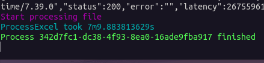

# Excel file api poc by @mikkurogue

This project is just a simple proof of concept to learn how to create a Go that reads an Excel file and spits this out as a json file.

There is some authentication in this, but no database or anything as of yet. It's just a simple example of how we can use Echo to create an API that also handles JWT authentication.

None of this is actually production worthy or ready for any real world use.

## Dependencies

All required packages are listed in the go.mod file. You can install them by running `go mod tidy`.

This only shows the list of packages used for a quick glance, along side which version of Go is minimally required to run this project.

1. Go (version 1.22.4 and above)
2. github.com/fatih/color
3. github.com/golang-jwt/v5
4. github.com/labstack/echo/v4
5. github.com/labstack/echo-jwt/v4
6. github.com/xuri/excelize/v2

## How to run

1. Clone the repo
2. Run `go run api/main.go`
3. Use Postman or any other API client to test the API

## Benchmark

The benchmark I used was essentially processing an excel file of around 740k rows. The file was around 70MB in size. This file has 2 sheets.

The first sheet has 18 columns and 738625 rows. The second sheet has 5 columns and 791 rows.

Processing takes on average, for this kind of file size and complexity to fully complete in around 4 minutes and 46 seconds. Which is by no means slow, which is why I'm happy with the results.

*Update*: benchmark also done on a different machine running linux. 

I'm happy with the results, given the Ryzen 5 5600X is a much slower and older cpu but it does give me some hope that I can speed this process up even more with some efficiency and potentially better usage of goroutines


Benchmark 1: Macbook pro running M3 chip Running Mac Os whatever the latest one s


Benchmark 2: AMD Ryzen 5 5600X @ 3.95 GHz + 32GB DDR4 @ 3600 MHz running Pop_OS 22.04 LTS


## Endpoints

For easier testing purposes, I have remove the "auth" requirement on the process and upload endpoints.
The auth enpoints here are generally only for "fun" and for me to remember that i can also just make this into a backend for an app if I really want to.

### POST /user/login
Payload
```json
{
    "username": "admin",
    "password": "admin"
}
```

### GET /auth/user/profile
Headers
```json
{
    "Authorization": Bearer <token>
}
```

### POST /upload/excel
Payload (Multipart form data)
```json
{
    "file": <file>
}
```

### GET /process/all


### GET /process/:id

